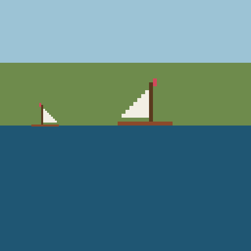

# java-programming-retrospective

**English** | [日本語概要](README.ja.md)

First-year-level Java coursework, rebuilt two semesters later.

I took an introductory Java module while on a university exchange and submitted
two programs. The module mark was **67/100**.
This repository is not that submission. It is what happens when I go back to
the same two problems with the habits I have now: the course's teaching
library removed, the logic separated from the input and the output, the data
invented rather than given, and 64 tests where there were none.

> **The code here was never graded.** The mark above is the mark for the
> module as it was assessed at the time. Everything in this repository was
> written afterwards, for this repository. The original submissions are not
> published here, and neither is any course material.

## What the module covered

Java syntax, control flow, arrays, file input, classes and objects, and simple
graphics — taught through a small helper library provided by the department
that wrapped console input and drawing so that beginners did not have to meet
`Scanner`, exceptions or Swing in week one.

## What I submitted at the time

Two console programs, at a high level:

1. **A weight conversion table.** Read a mass, converted it to kilograms,
   converted it again for a chosen body's gravity, and printed a table that
   also included entries read from a small data file.
2. **A pixel picture.** Read a grid of characters, decided what each character
   represented from arithmetic on its character code, and drew the result into
   a window at two sizes, one of them mirrored, with part of the image hidden
   below a waterline.

Both worked and both were marked. Neither had a single test, and re-reading
them is what this repository is about.

## What I would do differently, and did

| Then | Now | Why it matters |
|---|---|---|
| The department's helper library for all input and drawing | `BufferedReader`, `Files`, `ImageIO` | The program now compiles anywhere, with no library that only exists inside one course |
| A parse failure caught into an empty block | Every unreadable line returned as a `ParseProblem` with its line number and reason | A typo in the data file used to produce a table quietly missing a row; now it is reported and the exit code changes |
| The data file's format assumed | Three written forms accepted, anything else reported | The catalogue is written by a person, so it is inconsistent by nature |
| A fixed 130×130 grid read with no checks | Grid dimensions validated, ragged rows rejected with the offending row number | A data file one character short used to skew the whole picture silently |
| Classification by bare numbers in an if/else chain | An ordered, named, data-driven rule set in a properties file | The order of the rules changes the picture, and a test now asserts that it does |
| Drawing straight into a window | Drawing into a plain pixel buffer, with the file format at the very edge | The picture can be asserted on pixel by pixel; nothing needs a display |
| Data supplied by the course | Sample data generated by an encoder in this repository | The sample is mine, and a round-trip test proves the decoder is right |
| No tests | 64 tests, checkstyle, spotless, CI | The refactor above is only safe because of them |

## The picture

`data/sailboat.map` is the readable form of the sample sprite.
`data/sailboat.txt` is the same picture encoded as apparent noise, generated
from the map by this repository's own encoder. Decoding the second reproduces
the first exactly — that round trip is a test.

```
...........F........          "@\z:Vt.Lj&'^|>Xv8Rp
..........MF........          ,Jb"@\z:Vt/'j&D^|>Xv
..........M.........   encode 8Rp,Jb"@\z5Vt.Lj&D^|
.........SM.........  ------> >Xv8Rp,Jbs=\z:Vt.Lj&
        ...           <------          ...
..HHHHHHHHHHHHHH....   decode |>Wr3Ql*Ec!?]{6Tt.Lj
.....HHHHHHHH.......          @\z:Vo0Hf$B`~>Xv8Rp,
```



## Build and run

Requires JDK 17 or newer and Maven.

```bash
git clone https://github.com/sean-from-japan/java-programming-retrospective.git
cd java-programming-retrospective
mvn verify                      # compile, 64 tests, checkstyle, format check
```

```bash
# the weight table; exits 1 because the sample data has one deliberate bad line
java -jar target/java-programming-retrospective-1.0.0.jar weights data/gravity.txt 150

# decode the encoded sprite and draw the scene
java -jar target/java-programming-retrospective-1.0.0.jar scene data/sailboat.txt scene.png

# encode a readable map back into the puzzle form
java -jar target/java-programming-retrospective-1.0.0.jar encode data/sailboat.map encoded.txt
```

```
150 lb = 68.039 kg of mass

Body       Gravity   Weight (kg)
--------  --------  ------------
Earth        1.000        68.039
Titan        0.140         9.525
Ganymede     0.150        10.206
Europa       0.134         9.117
Ceres        0.029         1.973

1 line(s) could not be read:
  line 18: name has no gravity factor after it -- Mimas approximately
```

## Structure

```
weights/    Body, CatalogueParser, ParseProblem, WeightConverter, WeightTable
pixelart/   Material, MaterialRules, Sprite, SpriteEncoder,
            Raster, Scene, SceneRenderer, PngWriter
Main        argument parsing and exit codes only
```

The rule that shapes both packages: **anything that touches the outside world
sits at the edge, alone.** `PngWriter` is the only class that knows about an
image library; `Main` is the only class that knows about `System.out`. Every
other class takes values and returns values, which is why all 64 tests run in
under a second with no files, no window and no fixtures on disk.

## What I actually learned from doing this

- **An empty `catch` block is a decision to lose information.** It was the
  single worst habit in the original, and it is invisible until the data is
  wrong. The replacement is not "throw instead" — it is to make the failure a
  value the caller can print.
- **Untestable code is usually badly separated code, not hard code.** Nothing
  about drawing a boat is hard to test. Drawing it *straight into a window* is
  what made it untestable, and moving one class solved it.
- **Constants with no name are bugs waiting.** The classification rules were
  correct in the original and I could not have told you why. Putting them in a
  file with the sentence "the first match wins" is the actual fix.
- **Writing the inverse makes the original testable.** The encoder was not
  required by anything. It exists so the decoder can be checked, and it turned
  a "looks about right" program into a proved one.

## Limitations

- The sprite renderer draws whole cells at integer scale — no rotation, no
  blending, no anti-aliasing. That is the aesthetic, not an oversight.
- The catalogue parser accepts the three written forms described above. A
  fourth would need a fourth pattern; there is no general grammar here.
- The sentence form looks for `... of <name> is <number> ...` in English only.
- `Material` is a fixed enum. Adding a material means editing the enum, not
  only the rules file. Keeping the colours next to the meanings was worth that.

## What is deliberately not here

No course material of any kind: no assignment text, no lecture examples, no
quizzes, no worked solutions, no departmental helper library, and none of the
data files handed out with the exercises. No original submission is published,
verbatim or edited. Everything in `src/` and `data/` was written for this
repository.

## Licence

MIT — see [LICENSE](LICENSE). All code, documentation and sample data here are
my own work.
